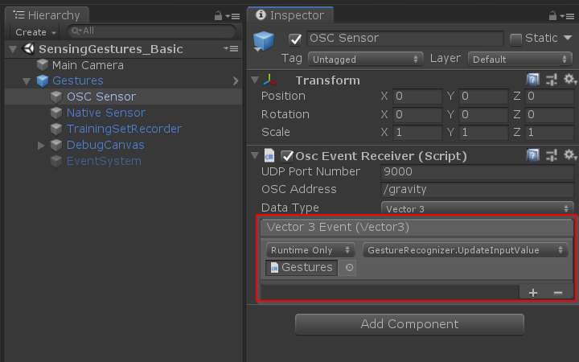
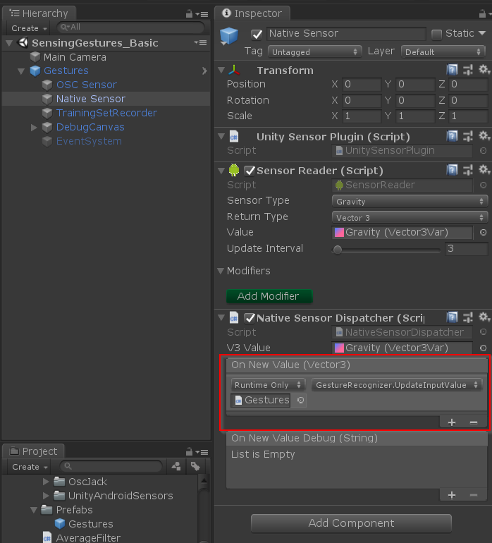

Gestures are basically a collection of points over time. To use gesture recognition, some template gestures are stored in a training set that is later used to compare and classify gestures, giving each try a match with a score. 

The general workflow when using them is to (1) wire the sensors to the gesture recognizer; (2) start/stop recording a few gestures for the training set; (3) start/stop recognizing input from the sensors; and finally (4) do something with the match/result information.

## Getting started

1. Add the `Gestures` prefab to a scene. It contains a few things to make easier to work with gestures, such as a basic debug user interface to visualize values and gestures, as well as a standard "wiring" of events.
2. Connect a sensor to the `UpdateInputValue` function of the `GestureRecognizer` component. You need to define which sensor you will use in the Inspector window for both the OSC Sensor and Native Sensor game objects. Make sure that both game objects are getting information from the same sensors. To connect, you can use the UnityEvent interface to access the `GestureRecognizer.UpdateInputValue` method (check highlights below).
   + OSC Sensor: Use the same port and OSC address value as in the Sensors2OSC app.
    
   + Native Sensor: Select the sensor and make sure that the `Sensor Reader` and the `Native Sensor Dispatcher` components reference the same values (`Gravity` in the example).
   + 
3. Now you can run the scene in the editor to test gesture recording and recognizing using the `Space` and `R` keyboard keys. On the training set file, you can change the name of your gestures to something more usable.
4. In a script from your game, you can declare a method `public void YourMethodName (Result result)` and connect it to the `OnRecognizedGesture` event on the `GestureRecognizer` component. Your method will be called with information about the result that you can then use.

## What can you do with gestures?

With the result of the gesture recognizer, you can use the result of quite elaborate or even evocative movements or actions by the player. It will be somewhat buggy there will be poor matches, for many reasons. For instance, as the gesture recognition algorithm used is two-dimensional, a simple remapping from 3D sensors (e.g. orientation, accelerometers) might be noisy.

However, this imprecision forms interesting design spaces for play. Having the gesture recognition in your system be less accurate in its matching can have all sorts of connections to narrative or systems.

## Limitations

+ The start and end moment have to be set intentionally, by starting and stopping the gesture recording. The library does not continuously monitor the sensors. How to do this will change from game to game, but a few ways are:
  + Start recording when the screen is touched or a button is pressed and stop recording when it is released.
  + Start recording when a sound or animation starts and stop when it is finished playing (this is how I done it on Red Dirt).
  + Start recording when a sensor value goes past a certain threshold (when a shake starts, for instance) and stop when the phone has stopped moving for a brief time.
